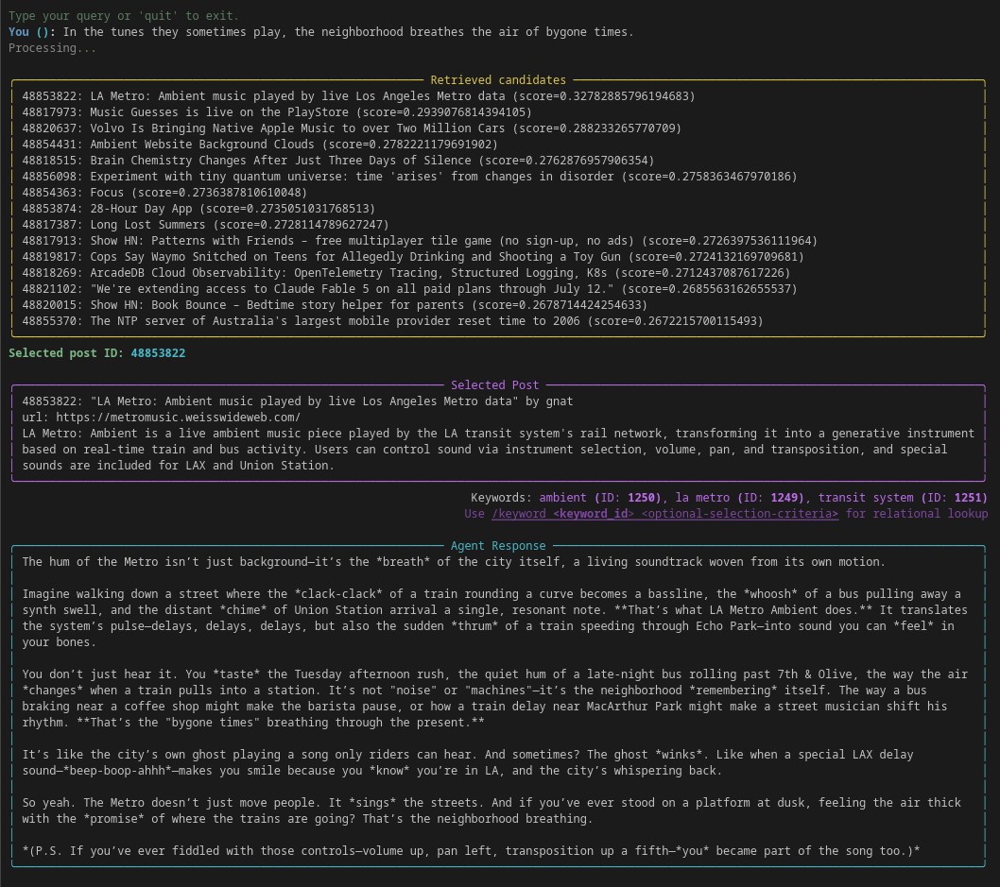

# Hacker News Wires Agent

> **🚧 Work in Progress** - This project is under active development. The ultimate goal is to build a **news curation assistant for content creation**.

A LangGraph-based conversational agent that enriches user conversations by associating inputs with relevant scraped Hacker News articles using semantic search.

Designed for small local models via specialized agents, this project can run entirely on your machine without GPUs or cloud APIs. It relies on the **Ollama** local LLM server for both text generation and embeddings.

## Screenshot



The project uses a SQLite database (`db.sqlite`) containing:
- Hacker News posts table
- Wire analysis summaries
- Vector embeddings for semantic search

The agent system used to construct this database is currently under review for publication.

## Installation

```bash
# Install dependencies
pip install -r requirements.txt

# Copy environment configuration
cp .env.example .env

# Edit .env to configure Ollama models and database path
```

### 🛠️ Ollama Notice

 Before running the agent you should:

1. Install Ollama following the instructions at https://ollama.com.
2. Start the server locally (the default port `11434` is used by the code).
3. Download the required models by running, for example:
	```bash
	ollama pull all-minilm:33m   # Embedding model
	ollama pull alibayram/hunyuan:0.5b   # Selector/Writer models
	```


## Usage

```bash
python main.py
```

The agent will start an interactive CLI where you can ask questions and receive responses enriched with relevant Hacker News content.


## Configuration

Key environment variables in `.env`:
* `OLLAMA_BASE_URL`: Ollama API endpoint (default: `http://localhost:11434`)
* `OLLAMA_EMBEDDING_MODEL`: Model for embeddings (default: `all-minilm:33m`)
* `SELECTOR_LLM_MODEL`: Model for post selection
* `WRITER_LLM_MODEL`: Model for response generation
* `DATABASE_PATH`: Path to SQLite database

## License

This project is licensed under the GNU General Public License v3.0. See the [LICENSE](LICENSE) file for details.

## Status

Experimental project for educational purposes.